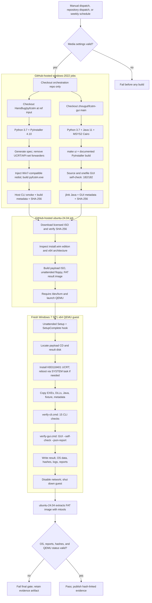

# Windows 7 Hosted-Runner Compatibility Gate

This repository is an orchestration-only compatibility gate for Windows
software. It builds upstream projects on free GitHub-hosted runners, boots a
real Windows 7 SP1 x64 guest with QEMU/KVM, executes the built products inside
that guest, and exports hash-linked evidence.

The repository intentionally does **not** vendor, mirror, submodule, or commit
the source of `pyfcstm`, `fcstm-gui`, Windows installation media, product keys,
golden images, or Microsoft runtime packages. Upstream source is checked out
into temporary runner workspaces during a workflow run.

The current gate validates two products:

| Product | Upstream checkout | Guest assertion |
| --- | --- | --- |
| `pyfcstm.exe` | `HansBug/pyfcstm@main` | guest CLI self-check (`15/15`), artifact hash |
| `fcstm-gui.exe` | `zhougut/fcstm-gui@main` | `--self-check --json-report`, `182/182`, artifact hash |

## Start Here

This is a reusable, orchestration-only compatibility gate. It does not copy
upstream source into this repository. Each run checks out the requested
revision into a temporary runner directory, builds it, boots a clean Windows 7
guest, and compares guest evidence with the build metadata.

### Five-minute run

1. Create a public GitHub repository from this repository, or use the existing
   `HansBug/pyfcstm-win7-gha-poc` repository.
2. Add an authorized Windows 7 SP1 x64 ISO URL and its SHA-256 as the
   `WIN7_ISO_URL` and `WIN7_ISO_SHA256` Actions secrets. Use an Actions
   variable named `WIN7_IMAGE_INDEX` for the `install.wim` edition index and
   optionally set `WIN7_LOCALE` (`en-US` or `zh-CN`).
3. Open **Actions -> Verify pyfcstm and fcstm-gui on Windows 7 SP1 -> Run
   workflow**. Leave `pyfcstm_ref` as `main` for the current baseline.
4. Wait for all four jobs to finish. The last job must be green; a green hosted
   build without a green guest/evidence job is not a compatibility result.
5. Download `win7-verification-evidence` and inspect the files listed in
   [Evidence and Reproduction](#evidence-and-reproduction).

The equivalent CLI flow is:

```bash
gh workflow run win7-qemu-poc.yml \
  --repo HansBug/pyfcstm-win7-gha-poc \
  --ref main \
  -f pyfcstm_ref=main
gh run list --repo HansBug/pyfcstm-win7-gha-poc \
  --workflow win7-qemu-poc.yml --limit 5
gh run watch RUN_ID --repo HansBug/pyfcstm-win7-gha-poc \
  --interval 20 --exit-status
gh run download RUN_ID --repo HansBug/pyfcstm-win7-gha-poc \
  --name win7-verification-evidence --dir evidence
```

Do not put private ISO URLs, product keys, access tokens, or ISO digests in
workflow source or shell history. Use repository secrets and verify the
downloaded bytes before relying on any result.

### Acceptance result at a glance

The run is accepted only when all of these conditions hold in the same run:

| Layer | Required evidence |
| --- | --- |
| Source provenance | Build metadata records the resolved upstream commit and selected ref |
| Hosted build | `windows-2022` build succeeds and host smoke checks pass |
| Guest OS | `Windows 7`, version `6.1.7601`, SP1, x64, `ProductType=1` |
| Guest execution | QEMU exits `0`; both products run with the guest NIC disabled |
| CLI contract | `pyfcstm-self-check.txt`: `total=15`, `passed=15`, `failed=0`, `status=passed` |
| GUI contract | JSON report: `status=passed`, `passed=182`, `failed=0` |
| Provenance link | Guest SHA-256 values equal the hashes from the corresponding hosted build jobs |
| Collector gate | `scripts/collect_win7_results.sh` exits `0`; the final workflow job is green |

## Verified Baseline

The latest complete two-product verification is run
[`29239888742`](https://github.com/HansBug/pyfcstm-win7-gha-poc/actions/runs/29239888742),
from PoC commit `1df30562db3c3d94fefdf7fef1e1cfd2138691c2`.

| Check | Result |
| --- | --- |
| Windows build runner | `windows-2022` |
| QEMU runner | `ubuntu-24.04` with `/dev/kvm` |
| Guest | Windows 7 Home Basic, `6.1.7601`, SP1, x64, `ProductType=1` |
| QEMU exit status | `0` |
| Guest result | `PASS` |
| `pyfcstm` source ref | `main` |
| `pyfcstm` source commit | `971687ca5649cd01bf00239179e38ffda8b5e838` |
| `pyfcstm` SHA-256 | `75506CA2EEB1B3B9DC69BD661C3D82F0828EC09080F0DEF3487B3E5DEA86F3A8` |
| `pyfcstm` guest self-check | `15/15`, `failed=0` |
| `fcstm-gui` source ref | `main` |
| `fcstm-gui` source commit | `62546ad6fa74d700a4cdc5697ee03daa37e1b21a` |
| `fcstm-gui` source self-check | `182/182`, `failed=0` |
| `fcstm-gui` onefile self-check | `182/182`, `failed=0` |
| `fcstm-gui` guest self-check | `182/182`, `failed=0` |
| `fcstm-gui` SHA-256 | `8D8FA8915649CD9224DA4D08380FFF5474873767941F2BE2C50FE79D49C72FFF` |

The run publishes these artifacts:

- `pyfcstm-win7-payload` - CLI executable, DSL fixture, and build metadata.
- `fcstm-gui-win7-payload` - GUI executable, portable Java runtime, self-check reports, and build metadata.
- `win7-verification-evidence` - guest OS information, result status, hashes, CLI/GUI self-check reports, Java version, and QEMU files.

Build payloads are retained for 14 days. Verification evidence is retained for
30 days. The ISO and guest system disk are never uploaded.

## What This Repository Proves

The gate proves this concrete claim:

> A particular upstream source revision can be built on a current free
> GitHub-hosted runner and the resulting Windows executable can start and pass
> its declared smoke/self-check contract inside a fresh Windows 7 SP1 x64 guest
> with the documented UCRT compatibility update.

It does **not** prove that every Windows 7 installation, third-party driver, or
an unpatched Windows 7 image will work. The guest installs Microsoft's
down-level UCRT update `KB3118401` before executing the products.

## End-to-End Flow



The authoritative implementation is
[`.github/workflows/win7-qemu-poc.yml`](.github/workflows/win7-qemu-poc.yml).

### Ownership boundaries

The repository is deliberately split into three trust and execution domains:

| Domain | Runner or machine | Owns | Must never contain |
| --- | --- | --- | --- |
| Orchestration | GitHub repository | Workflow YAML, guest scripts, image builders, evidence rules | Upstream source, ISO bytes, product keys, long-lived binaries |
| Hosted build | `windows-2022` | Temporary checkout, toolchain setup, executable build, host preflight, provenance metadata | A claim that the binary works on Windows 7 |
| Compatibility guest | Win7 SP1 QEMU guest launched by `ubuntu-24.04` | Actual loader/runtime behavior and offline product self-checks | Network access or uploaded system disks |

The boundary is important: a Windows 2022 smoke test proves that the artifact
was produced, while only the guest result proves that the artifact loaded and
ran under Windows 7. Hashes are the link between the two domains. The host
collector rejects a result when the guest hash, source metadata, OS report, or
self-check report is missing or inconsistent.

### File-to-stage map

| Path | Responsibility | When to change it |
| --- | --- | --- |
| `.github/workflows/win7-qemu-poc.yml` | Job graph, runner labels, inputs, artifact wiring, final gate | Adding a product, changing a toolchain, or changing a workflow trigger |
| `guest/Autounattend.xml` | Unattended Windows Setup answer file | Changing the guest edition, locale, disk layout, or setup phase |
| `guest/install-hook.cmd` | Installs the SetupComplete hook from the payload | Changing when the test starts during Windows Setup |
| `guest/run-ci.cmd` | Guest bootstrap, UCRT servicing, file copy, verifier execution, result writing, shutdown | Changing guest lifecycle or runtime dependencies |
| `guest/verify-cli.cmd` | Machine-readable pyfcstm CLI contract | Changing CLI commands or accepted diagnostics |
| `guest/verify-gui.cmd` | GUI onefile self-check contract | Changing GUI runtime checks |
| `scripts/build_payload_iso.sh` | Packages only the files needed by the guest | Adding a payload dependency or verifier asset |
| `scripts/build_unattend_floppy.sh` | Creates the unattended boot floppy | Changing Setup automation inputs |
| `scripts/build_results_image.sh` | Creates the small FAT evidence disk | Changing evidence capacity or volume label |
| `scripts/run_win7_qemu.sh` | Launches and times out QEMU/KVM | Changing virtual hardware, acceleration, or timeout behavior |
| `scripts/collect_win7_results.sh` | Extracts evidence and fails closed | Changing acceptance criteria or report schema |
| `scripts/*py` | Build-time compatibility policy and PyInstaller helpers | Only when the upstream/toolchain incompatibility is understood and tested |
| `README.md` / `CLAUDE.md` | Human-facing contract and maintainer policy | Whenever workflow behavior, evidence, or sources change |

When adding a new product, copy the data flow rather than bypassing it: build
metadata and a SHA-256 digest must be produced on the hosted runner, the guest
must run a stable verifier, and the collector must compare the two reports.

### Phase 1: Workflow selection and media validation

The workflow supports:

- `workflow_dispatch` for manual runs;
- `repository_dispatch` event `verify-pyfcstm-main` for an external release gate;
- a weekly schedule (`17 3 * * 1`, UTC).

The first job validates the ISO URL, 64-character digest, image index, locale,
and QEMU timeout. No build or guest job starts when this gate fails.

### Phase 2: Build `pyfcstm.exe`

The `build-pyfcstm` job checks out upstream source into
`_source/pyfcstm`; the PoC source tree remains separate:

1. Install Python `3.7`, GNU Make, ZIP tooling, MSYS2 Cairo, and upstream requirements.
2. Install and assert `PyInstaller==4.10`, whose requirements document Windows 7 compatibility.
3. Apply [`scripts/patch_pyinstaller_410_sanitizer.py`](scripts/patch_pyinstaller_410_sanitizer.py),
   supporting both PyInstaller code-cache layouts without disabling source
   sanitization.
4. Run upstream template/icon preparation and `tools.generate_spec`.
5. Remove hosted-runner `ucrtbase.dll` and `api-ms-win-*` entries with [`scripts/remove_win7_ucrt_binaries.py`](scripts/remove_win7_ucrt_binaries.py).
6. Inject the z3 wheel's compatible `msvcp140.dll` and selected Visual Studio
   `vcruntime140_1.dll` with [`scripts/add_win7_redist_binary.py`](scripts/add_win7_redist_binary.py).
7. Build with PyInstaller and normalize the upstream canonical filename to `dist/pyfcstm.exe`.
8. Assert the archive contains no UCRT/API-set forwarders, has one root z3 `msvcp140.dll`, and one Visual Studio `vcruntime140_1.dll`.
9. Run `pyfcstm.exe -v` and `pyfcstm.exe -h` on the Windows runner, then upload only the executable, DSL fixture, and metadata.

The host smoke is necessary but insufficient. Only guest execution establishes
Windows 7 compatibility.

### Phase 3: Build `fcstm-gui.exe`

The `build-fcstm-gui` job checks out `zhougut/fcstm-gui@main` into
`_source/fcstm-gui` and follows the upstream
[`fast-verify.yml`](https://github.com/zhougut/fcstm-gui/blob/main/.github/workflows/fast-verify.yml):

1. Install Python `3.7`, Java `11`, MSYS2 MINGW64 Cairo, and upstream requirements.
2. Run `make ui`.
3. Run `python main.py --self-check --json-report ...` and require `status=passed`, `passed=182`.
4. Run `pyinstaller --noconfirm main.spec`.
5. Run the onefile executable with `--self-check --json-report` and require the same `182/182` result.
6. Create a portable Java runtime with `jlink`; the guest is offline and the self-check executes PlantUML locally.
7. Upload the GUI executable, Java runtime, reports, log, redist DLL, and metadata.

The guest repeats the onefile self-check. Host success is provenance; the guest
JSON report is the compatibility result.

### Phase 4: Prepare guest images

The `verify-on-win7` job runs on `ubuntu-24.04` and requires readable/writable
`/dev/kvm`. It installs QEMU, `wimtools`, `mtools`, `dosfstools`, `xorriso`,
`p7zip`, and networking utilities. It then:

1. Downloads the ISO with byte-range requests and fallback URLs.
2. Verifies the exact configured ISO SHA-256.
3. Extracts `sources/install.wim` and verifies the selected image is Windows 7 x64.
4. Downloads Microsoft's `WindowsUCRT.zip`, extracts `Windows6.1-KB3118401-x64.msu`, then extracts the CAB.
5. Creates a payload ISO, unattended floppy, and FAT result image using the scripts under `scripts/`.

The ISO is never committed, cached, or uploaded.

### Phase 5: Unattended Windows 7 execution

[`scripts/run_win7_qemu.sh`](scripts/run_win7_qemu.sh) creates a fresh 24 GiB
QCOW2 disk and boots with KVM, two virtual CPUs, 3072 MiB RAM, no virtual NIC,
the Windows/payload CDs, unattended floppy, and FAT result disk.

Windows Setup consumes [`guest/Autounattend.xml`](guest/Autounattend.xml). The
offline payload CD is located by [`guest/install-hook.cmd`](guest/install-hook.cmd),
which copies `run-ci.cmd` into `SetupComplete.cmd`, so testing starts without
interactive login.

[`guest/run-ci.cmd`](guest/run-ci.cmd):

1. Locates the payload CD and result disk.
2. Installs the UCRT CAB; if DISM requests reboot, registers a SYSTEM logon task and resumes automatically.
3. Copies both executables, fixture, `vcruntime140_1.dll`, metadata, and Java to `C:\pyfcstm-win7-poc`.
4. Runs [`guest/verify-cli.cmd`](guest/verify-cli.cmd), which executes 15 CLI checks and writes `pyfcstm-self-check.txt`, then runs [`guest/verify-gui.cmd`](guest/verify-gui.cmd).
5. Writes `PASS`/`FAIL`, OS properties, hashes, logs, and reports to the FAT result disk.
6. Shuts down the guest for host extraction.

The guest has no network. `QT_QPA_PLATFORM=offscreen` is set for the GUI
self-check, testing executable/runtime behavior rather than a particular GPU.

#### CLI self-check contract

`guest/verify-cli.cmd` is intentionally independent of the upstream Python
test suite. It exercises the packaged executable directly, so the test remains
valid even when the source checkout is deleted after the hosted build. The 15
checks are:

| # | Check | Assertion |
| ---: | --- | --- |
| 1 | Version | `pyfcstm.exe -v` exits `0` and identifies pyfcstm |
| 2 | Help | top-level help exposes the expected commands |
| 3 | PlantUML | output file exists and contains `@startuml` / `@enduml` |
| 4 | JSON inspect | JSON output exists and contains `root_state_path` |
| 5 | Built-in template | Python template emits `machine.py` and `README.md` |
| 6 | Simulator help | simulator help and `--no-color` are available |
| 7 | Current state | batch simulator command reports the initial state |
| 8 | Cycle | one cycle completes and reports cycle/state output |
| 9 | Multiple commands | semicolon-separated batch commands complete |
| 10 | History | history command completes after multiple cycles |
| 11 | Settings | settings commands complete successfully |
| 12 | Clear | reset/clear returns the simulator to its initial state |
| 13 | No-color | non-interactive no-color mode exits successfully |
| 14 | Invalid input | a missing DSL file returns a non-zero status |
| 15 | Invalid command | an unknown simulator command fails or emits an explicit error |

The verifier writes a line for every check before writing the summary. A
missing, duplicated, or partially written report is rejected by the host
collector; it is not treated as a partial pass.

### Phase 6: Host evidence enforcement

[`scripts/collect_win7_results.sh`](scripts/collect_win7_results.sh) mounts the
FAT image read-only through `mtools` and fails closed unless:

- `result.txt` is `PASS`;
- OS caption contains Windows 7;
- version is `6.1.7601`, build is `7601`, service pack is `1`;
- product type is `1` and architecture is `64-bit`;
- both guest hashes equal the Windows build artifact hashes;
- `pyfcstm-self-check.txt` exists with `total=15`, `passed=15`, `failed=0`, and `status=passed`;
- GUI JSON exists with `"status": "passed"`, `"passed": 182`, and zero failures;
- guest Java version and required logs exist.

A green Windows build job alone is not enough: the final guest/evidence job must
also pass.

## Runner Policy and Research Conclusions

### Why the workflow uses these labels

`windows-2022` and `ubuntu-24.04` are current GitHub-hosted labels selected by
the workflow. A hosted-runner label is an image policy, not a historical image
archive. Retired labels such as `windows-7`, `windows-10`, `ubuntu-18.04`, or
`ubuntu-20.04` must not be treated as permanently available compatibility
environments. GitHub may retire or migrate images, so the run metadata and
evidence artifact always record the actual labels and tool versions used.

The runner decision is deliberate:

| Requirement | Decision | Why |
| --- | --- | --- |
| Build a Windows executable | `windows-2022` hosted runner | Current supported Windows image with the required MSYS2, Python, and Visual Studio tooling |
| Build the Linux/QEMU harness | `ubuntu-24.04` hosted runner | Current supported Ubuntu image with QEMU, `mtools`, `wimtools`, and KVM access |
| Reproduce an old Linux userspace | Optional container or a real QEMU guest | A container changes userspace but shares the host kernel; only a guest proves the old kernel/OS |
| Reproduce Windows 7 | Real Windows 7 guest under QEMU/KVM | No supported `windows-7` hosted label exists; Windows containers share or constrain host kernel versions |
| Keep the workflow free to run long term | Public repository + standard hosted labels | Standard hosted runners are free for public repositories; avoids self-hosted hardware and paid larger-runner custom images |

GitHub's hosted-runner documentation explicitly says that nested
virtualization is technically possible but unsupported. This repository treats
QEMU/KVM as an experimental, evidence-producing compatibility gate: the final
job requires `/dev/kvm`, records QEMU's exit status, preserves a screenshot and
result image, and fails closed if any guest assertion is missing. The workflow
does not claim that GitHub provides a supported Win7 runner.

This design keeps the repository within the requested hosted-runner model. It
does not require a self-hosted Windows machine or a permanently maintained
Windows 7 VM. Standard GitHub-hosted runners are free for public repositories,
but workflows are still subject to account, concurrency, storage,
artifact-retention, and service limits. Review the [GitHub Actions billing
documentation](https://docs.github.com/en/billing/managing-billing-for-your-products/managing-billing-for-github-actions/about-billing-for-github-actions)
and [GitHub-hosted runner
documentation](https://docs.github.com/en/actions/using-github-hosted-runners/about-github-hosted-runners)
and [GitHub Actions limits](https://docs.github.com/en/actions/reference/limits)
before treating the weekly schedule as unlimited capacity. A standard hosted
runner is not a promise that a retired image label will remain available.

### Linux old-version builds

On a current hosted Ubuntu runner, an old userspace container such as
`ubuntu:18.04` or `ubuntu:20.04` can approximate an older glibc/userspace build
environment when the host kernel is compatible. A container does not provide an
old kernel. If execution on the real old Linux operating system is part of the
claim, boot that operating system in QEMU/KVM and collect guest evidence, just
as this repository does for Windows 7.

### Windows 7 execution

There is no supported Windows 7 GitHub-hosted runner. Windows containers are
not a substitute: Windows container compatibility is tied to the host kernel
and cannot provide Windows 7 kernel/user-mode evidence. QEMU/KVM on a current
Linux hosted runner is the viable fully automated route.

The Windows 7 claim is intentionally two-layered:

1. Build-time policy removes newer hosted-SDK UCRT/API-set forwarders and keeps
   the compatible z3 `msvcp140.dll`.
2. Runtime evidence boots Windows 7 SP1, installs the down-level UCRT update,
   runs the real EXE, and verifies OS identity plus hashes.

An old Docker image or a successful Windows 2022 process cannot replace the
second layer.

## Configuration

Configure these repository settings before dispatching:

| Name | Kind | Required value |
| --- | --- | --- |
| `WIN7_ISO_URL` | Actions secret | HTTPS URL to an authorized Windows 7 SP1 ISO |
| `WIN7_ISO_SHA256` | Actions secret | SHA-256 of that exact ISO |
| `WIN7_IMAGE_INDEX` | Actions variable | Positive `install.wim` image index; current setup uses `1` |
| `WIN7_LOCALE` | Actions variable | `en-US` or `zh-CN`; scheduled run currently uses `zh-CN` |
| `WIN7_ISO_FALLBACK_URLS` | Actions variable | Optional newline-separated URLs for identical ISO bytes |

The dispatch form can temporarily override URL, digest, image index, locale,
QEMU timeout, and `pyfcstm_ref` without changing saved settings. The default
`pyfcstm_ref` is `main`.

### Manual dispatch with `gh`

Use an authorized GitHub identity. Do not put private ISO URLs or digests in
shell history or workflow logs.

```bash
gh workflow run win7-qemu-poc.yml --repo HansBug/pyfcstm-win7-gha-poc --ref main
gh run list --repo HansBug/pyfcstm-win7-gha-poc --workflow win7-qemu-poc.yml --limit 5
gh run watch RUN_ID --repo HansBug/pyfcstm-win7-gha-poc --interval 20 --exit-status
```

For an upstream release gate, send the `verify-pyfcstm-main`
`repository_dispatch` event. The workflow still checks out upstream sources at
run time; no source is copied into this repository.

## ISO and Runtime Sources

### Windows 7 ISO availability URLs

The primary ISO URL is intentionally stored in the `WIN7_ISO_URL` secret and
is not printed in logs. The current content-addressed public fallback set,
recorded from the successful baseline run, is:

```text
CID: bafybeiefkfbbmwcdhuuva34ufircuc4w266gmdvv4ojakxqeqp5o4vc3wy
```

| URL | Role |
| --- | --- |
| `https://ipfs.io/ipfs/bafybeiefkfbbmwcdhuuva34ufircuc4w266gmdvv4ojakxqeqp5o4vc3wy` | IPFS gateway used by the latest successful run |
| `https://dweb.link/ipfs/bafybeiefkfbbmwcdhuuva34ufircuc4w266gmdvv4ojakxqeqp5o4vc3wy` | Equivalent IPFS gateway |
| `https://gateway.ipfs.io/ipfs/bafybeiefkfbbmwcdhuuva34ufircuc4w266gmdvv4ojakxqeqp5o4vc3wy` | Equivalent IPFS gateway |
| `https://ipfs.filebase.io/ipfs/bafybeiefkfbbmwcdhuuva34ufircuc4w266gmdvv4ojakxqeqp5o4vc3wy` | Equivalent IPFS gateway |

These URLs are availability sources, not license grants or Microsoft-hosted
distribution channels. Public gateways can disappear, throttle, or return an
error; keep at least one authorized source in `WIN7_ISO_URL` and use the
fallback list only for identical bytes. The repository owner is responsible for
confirming that the selected Windows media is licensed for the intended use.

#### ISO verification procedure

Never trust a filename, mirror description, or gateway alone. Download to a
temporary directory, compute the digest, and inspect the WIM before placing the
URL and digest in Actions settings:

```bash
url='https://ipfs.io/ipfs/bafybeiefkfbbmwcdhuuva34ufircuc4w266gmdvv4ojakxqeqp5o4vc3wy'
curl --fail --location --retry 5 --output /tmp/windows7.iso "$url"
sha256sum /tmp/windows7.iso
7z l /tmp/windows7.iso | sed -n '1,80p'
```

The printed digest must equal the secret `WIN7_ISO_SHA256`. The workflow then
extracts `sources/install.wim`, runs `wiminfo`, and rejects the image unless the
selected index is Windows 7 SP1 x64. For this repository's baseline, index `1`
is Windows 7 Home Basic, build `7601`, architecture `x86_64`, with `zh-CN` as
the image language. A different edition or language is valid only if its WIM
metadata and expected guest assertions are updated together.

#### Official Microsoft and licensing references

Microsoft's old [Windows 7 software download page](https://www.microsoft.com/en-us/software-download/windows7)
now redirects to the general software-download catalog and does not provide a
stable anonymous Windows 7 ISO URL. The [Windows 7 lifecycle page](https://learn.microsoft.com/en-us/lifecycle/products/windows-7)
records the end of support. Obtain media through a valid product, volume
licensing, MSDN, or organizational portal entitlement, then use this gate only
to validate the bytes you are authorized to use. Do not infer licensing from an
IPFS CID or from this repository.

### Microsoft UCRT source

The workflow downloads the official Microsoft package from:

```text
https://download.microsoft.com/download/3/1/1/311c06c1-f162-405c-b538-d9dc3a4007d1/WindowsUCRT.zip
```

It extracts `Windows6.1-KB3118401-x64.msu` and the x64 CAB. The CAB is placed
on the ephemeral payload ISO and installed centrally in the guest; it is not
committed here.

### Upstream source URLs

- [`HansBug/pyfcstm` main](https://github.com/HansBug/pyfcstm/tree/main)
- [`pyfcstm` verified commit](https://github.com/HansBug/pyfcstm/commit/971687ca5649cd01bf00239179e38ffda8b5e838)
- [`zhougut/fcstm-gui` main](https://github.com/zhougut/fcstm-gui/tree/main)
- [`fcstm-gui` verified commit](https://github.com/zhougut/fcstm-gui/commit/62546ad6fa74d700a4cdc5697ee03daa37e1b21a)
- [`fcstm-gui` documented Windows workflow](https://github.com/zhougut/fcstm-gui/blob/main/.github/workflows/fast-verify.yml)

## Evidence and Reproduction

Inspect jobs first:

```bash
gh run view RUN_ID --repo HansBug/pyfcstm-win7-gha-poc --json status,conclusion,jobs
```

Download artifacts:

```bash
gh run download RUN_ID --repo HansBug/pyfcstm-win7-gha-poc --name win7-verification-evidence --dir evidence
gh run download RUN_ID --repo HansBug/pyfcstm-win7-gha-poc --name fcstm-gui-win7-payload --dir gui-payload
gh run download RUN_ID --repo HansBug/pyfcstm-win7-gha-poc --name pyfcstm-win7-payload --dir cli-payload
```

Important evidence files:

| File | Meaning |
| --- | --- |
| `result.txt` / `failure.txt` | Guest status and failure reason |
| `os.txt` | Caption, version, build, service pack, product type, architecture |
| `hash.txt` / `fcstm-gui-hash.txt` | Windows `certutil` hashes |
| `pyfcstm-self-check.txt` | Machine-readable 15-check CLI guest contract |
| `pyfcstm-verify.log` / `pyfcstm-self-check-commands.log` | CLI self-check output and command transcripts |
| `fcstm-gui-self-check.json` / `.log` | Machine-readable and human-readable guest self-check |
| `java-version-guest.txt` | Java runtime used by the GUI |
| `build-metadata.txt` files | Source revisions, tool versions, expected hashes |
| `qemu-exit-status.txt` | Host-side QEMU exit status |

Minimal GUI JSON audit:

```bash
python - <<'PY'
import json
from pathlib import Path
report = next(Path("evidence").glob("**/fcstm-gui-self-check.json"))
payload = json.loads(report.read_text(encoding="utf-8"))
assert payload["status"] == "passed"
assert payload["counts"]["passed"] == 182
assert payload["counts"]["failed"] == 0
print(payload["counts"])
PY
sha256sum cli-payload/pyfcstm.exe gui-payload/fcstm-gui.exe
```

Do not call a product Win7-verified from host logs alone. The guest JSON,
guest hashes, OS report, and same-run build metadata must agree.

## Adding Another Software Project

Use the existing path as a reusable template:

1. Checkout third-party source into a job-local `_source/<name>` directory.
2. Build on a current free hosted runner with the oldest supported toolchain.
3. Run a host smoke test as preflight only.
4. Upload only the executable, required data/runtime dependencies, and provenance metadata.
5. Add a guest verifier with stable exit codes and machine-readable output.
6. Include the executable hash in guest evidence and compare it on the host.
7. Add product-specific assertions to the evidence collector.
8. Keep the guest offline unless network behavior is the subject under test.
9. Update the README product table, Mermaid diagram, evidence schema, URLs, and references together.
10. Run a full guest verification before claiming support.

Before editing the workflow, write down this product record. It prevents a
new target from accidentally inheriting pyfcstm-specific assumptions:

| Field | Example for a new product |
| --- | --- |
| Upstream source | Repository, ref, and resolved commit recorded in metadata |
| Build job | Hosted runner label, language/tool versions, and build command |
| Artifact closure | Executable plus every DLL, data file, font, JVM, or interpreter needed offline |
| Host preflight | Fast command that proves the build artifact is structurally complete |
| Guest command | Exact command or verifier script run inside the old OS |
| Report schema | Stable text/JSON fields for total, passed, failed, and status |
| Hash link | Build-side digest and guest-side digest compared by the collector |
| OS assertion | Caption, version, architecture, service pack, and any required update |
| Failure evidence | Logs, screenshot, result disk, and a clear failure reason |
| Retention | Short-lived artifacts only; no system disk or installer media upload |

The implementation order should follow the dependency direction: build and
metadata first, payload packaging second, guest verifier third, collector
assertions fourth, documentation and a full run last. Do not add a collector
assertion that the guest never writes, and do not make a guest report depend on
files that are absent from the payload.

## Troubleshooting

| Symptom | Likely cause | Investigation |
| --- | --- | --- |
| Media validation fails | Missing setting, malformed digest, locale, or timeout | Inspect repository settings; never paste secrets into logs |
| ISO hash fails | URL serves different bytes or gateway changed | Use an authorized source of the configured exact hash |
| `KeyError: code_cache` | PyInstaller 4.10 cache layout mismatch | Confirm the sanitizer compatibility step ran |
| `dist/pyfcstm.exe` missing | Upstream canonical version/platform filename | Preserve upstream output, then normalize the stable guest name |
| UCRT/API-set assertion fails | Hosted SDK DLL leaked into onefile bundle | Inspect `build/pyi-archive.txt` and `PKG-00.toc`; do not weaken assertions |
| Guest stops before GUI evidence | CLI smoke, UCRT install, or file copy failed | Read `failure.txt` and `pyfcstm-verify.log` first |
| GUI self-check fails only in guest | Missing Java, Qt/Cairo dependency, or Win7 loader issue | Read guest GUI log, Java version, OS report, and hashes together |
| `PASS` but collector fails | Missing evidence, malformed JSON, or hash mismatch | Treat collector failure as authoritative |
| QEMU timeout | Slow setup, missing KVM, or guest did not shut down | Check `/dev/kvm`, screenshots, timeout, and preserved evidence |
| Guest CLI report has duplicate totals or skipped labels | Win7 `cmd.exe` batch control-flow behavior | Keep `guest/verify-cli.cmd` linear; do not reintroduce label subroutine calls |
| Guest starts but a DLL entry point is missing | Hosted SDK/UCRT binary leaked into the bundle | Inspect the archive and use an app-local compatible runtime only when documented |
| UCRT install requests a reboot | DISM returned `3010` | Let `run-ci.cmd` register its SYSTEM resume task; do not run the verifier before servicing completes |
| ISO URL works locally but workflow cannot download it | Gateway throttling, range-request behavior, or an expired URL | Add an identical-byte fallback and re-check the configured digest |

Do not fix a compatibility failure by removing the guest assertion. A green
workflow with weak evidence is worse than a red workflow with a precise reason.

## Security, Licensing, and Retention

- Keep `WIN7_ISO_URL` and `WIN7_ISO_SHA256` in Actions secrets when the source is private or licensed.
- Never commit product keys, activation tokens, ISO files, QCOW2 disks, UCRT CABs, or downloaded artifacts.
- Public IPFS gateways are availability mechanisms only; they do not establish rights to use Windows media.
- The guest has no virtual NIC, reducing accidental network exposure.
- Artifact retention is short; archive evidence separately when a longer audit trail is required.
- Review upstream licenses before reusing their executables or runtime dependencies outside this gate.

## Repository Layout

```text
.
|-- .github/workflows/win7-qemu-poc.yml  # Orchestration and all jobs
|-- guest/
|   |-- Autounattend.xml                 # Windows Setup answer file
|   |-- install-hook.cmd                 # Installs SetupComplete hook
|   |-- run-ci.cmd                       # Guest lifecycle and evidence writer
|   |-- verify-cli.cmd                   # pyfcstm guest contract
|   `-- verify-gui.cmd                   # fcstm-gui guest self-check contract
|-- scripts/                             # Image, QEMU, build-policy, collector helpers
|-- CLAUDE.md                            # Repository maintenance contract
`-- AGENTS.md -> CLAUDE.md               # Symlink; edit CLAUDE.md only
```

## Local Checks Before Pushing

These catch malformed orchestration changes but do not replace a full guest run:

```bash
python - <<'PY'
from pathlib import Path
import yaml
yaml.safe_load(Path('.github/workflows/win7-qemu-poc.yml').read_text())
print('workflow YAML: ok')
PY
bash -n scripts/*.sh
python -m py_compile scripts/*.py
rm -rf scripts/__pycache__
git diff --check
test "$(readlink AGENTS.md)" = CLAUDE.md
```

For changes to the guest or evidence collector, dispatch the complete workflow
and attach the successful run URL to the review or release note.

## Maintainer Acceptance Checklist

Use this checklist for every new software project or compatibility change:

- [ ] The orchestration repository contains no upstream source, ISO, product
      key, QCOW2 disk, UCRT CAB, or unbounded downloaded artifact.
- [ ] The workflow checks out the upstream repository and records the resolved
      commit, ref, tool versions, and build hash.
- [ ] The build runs on a current standard hosted runner and has a small host
      smoke test that does not masquerade as old-OS evidence.
- [ ] Every runtime dependency needed by the guest is explicitly copied into
      the payload and explained in a script comment and this README.
- [ ] The guest verifier is deterministic, offline, exits non-zero on a
      failed assertion, and writes a machine-readable report.
- [ ] The guest writes OS identity, result status, hashes, logs, and report
      files to the result image before shutdown.
- [ ] The host collector compares guest hashes to build metadata and fails
      closed on missing, duplicated, malformed, or partial reports.
- [ ] The full workflow passes once after the change; local YAML/Bash/Python
      checks are not a substitute for the guest run.
- [ ] `README.md` records the new run URL, upstream commit, source URL, and
      any changed acceptance assumptions.
- [ ] `CLAUDE.md` remains the single guidance file and `AGENTS.md` remains a
      symlink to it.

For a release or external acceptance report, archive the run URL and the
`win7-verification-evidence` artifact together. Never claim compatibility from
an uploaded executable without the same-run guest report and hash comparison.

## References

### Research notes and decision record

The following sources were consulted while designing this gate. The conclusions
are recorded here so a future maintainer can re-check the assumptions instead
of treating them as folklore. Links are official documentation or the exact
upstream repositories used by the workflow; availability and policy can change,
so re-read them when GitHub changes runner generations. The last research pass
was checked on `2026-07-13`.

| Topic | Source | Practical conclusion used here |
| --- | --- | --- |
| Hosted runner model and maintenance | [GitHub-hosted runners](https://docs.github.com/en/actions/using-github-hosted-runners/about-github-hosted-runners) | Runners are disposable VMs, images are maintained by GitHub, and nested virtualization is technically possible but explicitly unsupported |
| Available image labels and support window | [`actions/runner-images`](https://github.com/actions/runner-images#available-images), [image support policy](https://github.com/actions/runner-images#software-and-image-support) | YAML labels identify maintained image generations; the project supports the latest two OS versions and retires older images |
| Public-repository pricing | [GitHub Actions billing](https://docs.github.com/en/billing/managing-billing-for-your-products/managing-billing-for-github-actions/about-billing-for-github-actions) | Standard hosted runners are free for public repositories; larger runners and storage have different billing rules |
| Cross-repository checkout | [`actions/checkout` README](https://github.com/actions/checkout#checkout-multiple-repos-private) | `repository`, `ref`, and `path` allow the orchestration repository to build upstream source without vendoring it |
| Full-system compatibility testing | [QEMU system emulation](https://www.qemu.org/docs/master/system/introduction.html) | QEMU models a complete machine; KVM accelerates execution when `/dev/kvm` is available |
| Windows containers | [Windows container version compatibility](https://learn.microsoft.com/en-us/virtualization/windowscontainers/deploy-containers/version-compatibility) | Windows user/kernel version matching constrains container images; a Windows 2022 container is not Windows 7 evidence |
| Universal CRT deployment | [Universal CRT deployment](https://learn.microsoft.com/en-us/cpp/windows/universal-crt-deployment?view=msvc-170) | UCRT is an OS component on newer Windows and can be centrally deployed to older supported systems |
| Microsoft redistributable files | [Windows SDK redist lists](https://learn.microsoft.com/en-us/legal/windows-sdk/redist) | `Windows6.1-KB3118401-x64.msu` is a Microsoft-listed UCRT package; the workflow downloads it at run time and never commits it |
| PyInstaller compatibility | [PyInstaller 4.10 requirements](https://pyinstaller.org/en/v4.10/requirements.html) | The selected PyInstaller generation documents Windows 7 support and is pinned in the hosted build |
| Windows 7 lifecycle | [Windows 7 lifecycle](https://learn.microsoft.com/en-us/lifecycle/products/windows-7) | Windows 7 is out of support; this gate is a compatibility experiment, not a security-support claim |

The investigation also considered `ubuntu:18.04`/`ubuntu:20.04` containers for
old Linux builds. They can provide an older userspace and glibc, but share the
host kernel; use a real QEMU guest when kernel behavior is part of the claim.
Likewise, a retired `windows-7` or `windows-10` hosted label cannot be restored
by changing YAML, and a Windows container cannot supply a Windows 7 kernel.

### GitHub Actions and artifacts

- [GitHub-hosted runners](https://docs.github.com/en/actions/reference/runners/github-hosted-runners)
- [GitHub Actions limits](https://docs.github.com/en/actions/reference/limits)
- [Workflow artifacts](https://docs.github.com/en/actions/using-workflows/storing-workflow-data-as-artifacts)
- [GitHub runner images](https://github.com/actions/runner-images)
- [actions/checkout](https://github.com/actions/checkout)
- [msys2/setup-msys2](https://github.com/msys2/setup-msys2)

### Windows, QEMU, and unattended setup

- [Windows container version compatibility](https://learn.microsoft.com/en-us/virtualization/windowscontainers/deploy-containers/version-compatibility)
- [Windows version reporting](https://learn.microsoft.com/en-us/windows/win32/sysinfo/operating-system-version)
- [Win32_OperatingSystem properties](https://learn.microsoft.com/en-us/windows/win32/cimwin32prov/win32-operatingsystem)
- [Universal CRT deployment](https://learn.microsoft.com/en-us/cpp/windows/universal-crt-deployment?view=msvc-170)
- [DISM package servicing](https://learn.microsoft.com/en-us/windows-hardware/manufacture/desktop/dism-operating-system-package-servicing-command-line-options)
- [Packer unattended Windows installation](https://developer.hashicorp.com/packer/guides/automatic-operating-system-installs/autounattend_windows)
- [QEMU system emulation](https://www.qemu.org/docs/master/system/introduction.html)
- [Java 11 `jlink`](https://docs.oracle.com/en/java/javase/11/docs/specs/man/jlink.html)

### PyInstaller and upstream projects

- [PyInstaller 4.10 requirements](https://pyinstaller.org/en/v4.10/requirements.html)
- [PyInstaller 5.13.2 requirements](https://pyinstaller.org/en/v5.13.2/requirements.html)
- [`HansBug/pyfcstm` main](https://github.com/HansBug/pyfcstm/tree/main)
- [`fcstm-gui` main](https://github.com/zhougut/fcstm-gui/tree/main)
- [`fcstm-gui` documented Windows workflow](https://github.com/zhougut/fcstm-gui/blob/main/.github/workflows/fast-verify.yml)

### Repository evidence

- [Latest successful two-product run](https://github.com/HansBug/pyfcstm-win7-gha-poc/actions/runs/29239888742)
- [PoC workflow](.github/workflows/win7-qemu-poc.yml)
- [Guest CLI verifier](guest/verify-cli.cmd)
- [Guest GUI verifier](guest/verify-gui.cmd)
- [Host evidence collector](scripts/collect_win7_results.sh)

## Guidance Files

`CLAUDE.md` is the single source of repository-specific agent and maintainer
guidance. `AGENTS.md` is a symbolic link to `CLAUDE.md` so tools that discover
either conventional filename receive the same rules. Edit `CLAUDE.md` only;
never create divergent copies.
