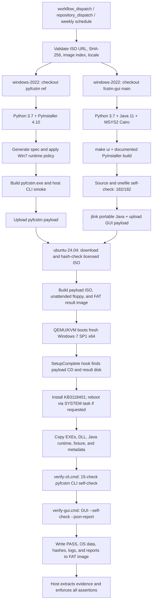

# Windows 7 Hosted-Runner Compatibility Gate

This repository is an orchestration-only compatibility gate for Windows
software. It builds upstream projects on free GitHub-hosted runners, boots a
real Windows 7 SP1 x64 guest with QEMU/KVM, executes the built products inside
that guest, and exports hash-linked evidence.

The repository intentionally does **not** vendor, mirror, submodule, or commit
the source of `pyfcstm`, `fcstm-gui`, Windows installation media, product keys,
golden images, or Microsoft runtime packages. Upstream source is checked out
into temporary runner workspaces during a workflow run.

The current gate validates two products:

| Product | Upstream checkout | Guest assertion |
| --- | --- | --- |
| `pyfcstm.exe` | `HansBug/pyfcstm@main` | guest CLI self-check (`15/15`), artifact hash |
| `fcstm-gui.exe` | `zhougut/fcstm-gui@main` | `--self-check --json-report`, `182/182`, artifact hash |

## Verified Baseline

The latest complete two-product verification is run
[`29239888742`](https://github.com/HansBug/pyfcstm-win7-gha-poc/actions/runs/29239888742),
from PoC commit `1df3056`.

| Check | Result |
| --- | --- |
| Windows build runner | `windows-2022` |
| QEMU runner | `ubuntu-24.04` with `/dev/kvm` |
| Guest | Windows 7 Home Basic, `6.1.7601`, SP1, x64, `ProductType=1` |
| QEMU exit status | `0` |
| Guest result | `PASS` |
| `pyfcstm` source ref | `main` |
| `pyfcstm` source commit | `971687ca5649cd01bf00239179e38ffda8b5e838` |
| `pyfcstm` SHA-256 | `75506CA2EEB1B3B9DC69BD661C3D82F0828EC09080F0DEF3487B3E5DEA86F3A8` |
| `pyfcstm` guest self-check | `15/15`, `failed=0` |
| `fcstm-gui` source commit | `62546ad6fa74d700a4cdc5697ee03daa37e1b21a` |
| `fcstm-gui` source self-check | `182/182`, `failed=0` |
| `fcstm-gui` onefile self-check | `182/182`, `failed=0` |
| `fcstm-gui` guest self-check | `182/182`, `failed=0` |
| `fcstm-gui` SHA-256 | `90DBA66AB9BB115010815037323E0B9EE0C6A6CFD04F782B4E6C799F21435799` |

The run publishes these artifacts:

- `pyfcstm-win7-payload` - CLI executable, DSL fixture, and build metadata.
- `fcstm-gui-win7-payload` - GUI executable, portable Java runtime, self-check reports, and build metadata.
- `win7-verification-evidence` - guest OS information, result status, hashes, CLI/GUI self-check reports, Java version, and QEMU files.

Build payloads are retained for 14 days. Verification evidence is retained for
30 days. The ISO and guest system disk are never uploaded.

## What This Repository Proves

The gate proves this concrete claim:

> A particular upstream source revision can be built on a current free
> GitHub-hosted runner and the resulting Windows executable can start and pass
> its declared smoke/self-check contract inside a fresh Windows 7 SP1 x64 guest
> with the documented UCRT compatibility update.

It does **not** prove that every Windows 7 installation, third-party driver, or
an unpatched Windows 7 image will work. The guest installs Microsoft's
down-level UCRT update `KB3118401` before executing the products.

## End-to-End Flow



The authoritative implementation is
[`.github/workflows/win7-qemu-poc.yml`](.github/workflows/win7-qemu-poc.yml).

### Phase 1: Workflow selection and media validation

The workflow supports:

- `workflow_dispatch` for manual runs;
- `repository_dispatch` event `verify-pyfcstm-main` for an external release gate;
- a weekly schedule (`17 3 * * 1`, UTC).

The first job validates the ISO URL, 64-character digest, image index, locale,
and QEMU timeout. No build or guest job starts when this gate fails.

### Phase 2: Build `pyfcstm.exe`

The `build-pyfcstm` job checks out upstream source into
`_source/pyfcstm`; the PoC source tree remains separate:

1. Install Python `3.7`, GNU Make, ZIP tooling, MSYS2 Cairo, and upstream requirements.
2. Install and assert `PyInstaller==4.10`, whose requirements document Windows 7 compatibility.
3. Apply [`scripts/patch_pyinstaller_410_sanitizer.py`](scripts/patch_pyinstaller_410_sanitizer.py),
   supporting both PyInstaller code-cache layouts without disabling source
   sanitization.
4. Run upstream template/icon preparation and `tools.generate_spec`.
5. Remove hosted-runner `ucrtbase.dll` and `api-ms-win-*` entries with [`scripts/remove_win7_ucrt_binaries.py`](scripts/remove_win7_ucrt_binaries.py).
6. Inject the z3 wheel's compatible `msvcp140.dll` and selected Visual Studio
   `vcruntime140_1.dll` with [`scripts/add_win7_redist_binary.py`](scripts/add_win7_redist_binary.py).
7. Build with PyInstaller and normalize the upstream canonical filename to `dist/pyfcstm.exe`.
8. Assert the archive contains no UCRT/API-set forwarders, has one root z3 `msvcp140.dll`, and one Visual Studio `vcruntime140_1.dll`.
9. Run `pyfcstm.exe -v` and `pyfcstm.exe -h` on the Windows runner, then upload only the executable, DSL fixture, and metadata.

The host smoke is necessary but insufficient. Only guest execution establishes
Windows 7 compatibility.

### Phase 3: Build `fcstm-gui.exe`

The `build-fcstm-gui` job checks out `zhougut/fcstm-gui@main` into
`_source/fcstm-gui` and follows the upstream
[`fast-verify.yml`](https://github.com/zhougut/fcstm-gui/blob/main/.github/workflows/fast-verify.yml):

1. Install Python `3.7`, Java `11`, MSYS2 MINGW64 Cairo, and upstream requirements.
2. Run `make ui`.
3. Run `python main.py --self-check --json-report ...` and require `status=passed`, `passed=182`.
4. Run `pyinstaller --noconfirm main.spec`.
5. Run the onefile executable with `--self-check --json-report` and require the same `182/182` result.
6. Create a portable Java runtime with `jlink`; the guest is offline and the self-check executes PlantUML locally.
7. Upload the GUI executable, Java runtime, reports, log, redist DLL, and metadata.

The guest repeats the onefile self-check. Host success is provenance; the guest
JSON report is the compatibility result.

### Phase 4: Prepare guest images

The `verify-on-win7` job runs on `ubuntu-24.04` and requires readable/writable
`/dev/kvm`. It installs QEMU, `wimtools`, `mtools`, `dosfstools`, `xorriso`,
`p7zip`, and networking utilities. It then:

1. Downloads the ISO with byte-range requests and fallback URLs.
2. Verifies the exact configured ISO SHA-256.
3. Extracts `sources/install.wim` and verifies the selected image is Windows 7 x64.
4. Downloads Microsoft's `WindowsUCRT.zip`, extracts `Windows6.1-KB3118401-x64.msu`, then extracts the CAB.
5. Creates a payload ISO, unattended floppy, and FAT result image using the scripts under `scripts/`.

The ISO is never committed, cached, or uploaded.

### Phase 5: Unattended Windows 7 execution

[`scripts/run_win7_qemu.sh`](scripts/run_win7_qemu.sh) creates a fresh 24 GiB
QCOW2 disk and boots with KVM, two virtual CPUs, 3072 MiB RAM, no virtual NIC,
the Windows/payload CDs, unattended floppy, and FAT result disk.

Windows Setup consumes [`guest/Autounattend.xml`](guest/Autounattend.xml). The
offline payload CD is located by [`guest/install-hook.cmd`](guest/install-hook.cmd),
which copies `run-ci.cmd` into `SetupComplete.cmd`, so testing starts without
interactive login.

[`guest/run-ci.cmd`](guest/run-ci.cmd):

1. Locates the payload CD and result disk.
2. Installs the UCRT CAB; if DISM requests reboot, registers a SYSTEM logon task and resumes automatically.
3. Copies both executables, fixture, `vcruntime140_1.dll`, metadata, and Java to `C:\pyfcstm-win7-poc`.
4. Runs [`guest/verify-cli.cmd`](guest/verify-cli.cmd), which executes 15 CLI checks and writes `pyfcstm-self-check.txt`, then runs [`guest/verify-gui.cmd`](guest/verify-gui.cmd).
5. Writes `PASS`/`FAIL`, OS properties, hashes, logs, and reports to the FAT result disk.
6. Shuts down the guest for host extraction.

The guest has no network. `QT_QPA_PLATFORM=offscreen` is set for the GUI
self-check, testing executable/runtime behavior rather than a particular GPU.

### Phase 6: Host evidence enforcement

[`scripts/collect_win7_results.sh`](scripts/collect_win7_results.sh) mounts the
FAT image read-only through `mtools` and fails closed unless:

- `result.txt` is `PASS`;
- OS caption contains Windows 7;
- version is `6.1.7601`, build is `7601`, service pack is `1`;
- product type is `1` and architecture is `64-bit`;
- both guest hashes equal the Windows build artifact hashes;
- `pyfcstm-self-check.txt` exists with `total=15`, `passed=15`, `failed=0`, and `status=passed`;
- GUI JSON exists with `"status": "passed"`, `"passed": 182`, and zero failures;
- guest Java version and required logs exist.

A green Windows build job alone is not enough: the final guest/evidence job must
also pass.

## Runner Policy and Research Conclusions

### Why the workflow uses these labels

`windows-2022` and `ubuntu-24.04` are current GitHub-hosted labels selected by
the workflow. A hosted-runner label is an image policy, not a historical image
archive. Retired labels such as `windows-7`, `windows-10`, `ubuntu-18.04`, or
`ubuntu-20.04` must not be treated as permanently available compatibility
environments. GitHub may retire or migrate images, so the run metadata and
evidence artifact always record the actual labels and tool versions used.

This design keeps the repository within the requested hosted-runner model. It
does not require a self-hosted Windows machine or a permanently maintained
Windows 7 VM. Public repositories may have hosted-runner minute allowances,
but they are still subject to GitHub account, concurrency, storage, and usage
limits; see the [GitHub Actions limits](https://docs.github.com/en/actions/reference/limits)
documentation before treating the weekly schedule as unlimited capacity.

### Linux old-version builds

On a current hosted Ubuntu runner, an old userspace container such as
`ubuntu:18.04` or `ubuntu:20.04` can approximate an older glibc/userspace build
environment when the host kernel is compatible. A container does not provide an
old kernel. If execution on the real old Linux operating system is part of the
claim, boot that operating system in QEMU/KVM and collect guest evidence, just
as this repository does for Windows 7.

### Windows 7 execution

There is no supported Windows 7 GitHub-hosted runner. Windows containers are
not a substitute: Windows container compatibility is tied to the host kernel
and cannot provide Windows 7 kernel/user-mode evidence. QEMU/KVM on a current
Linux hosted runner is the viable fully automated route.

The Windows 7 claim is intentionally two-layered:

1. Build-time policy removes newer hosted-SDK UCRT/API-set forwarders and keeps
   the compatible z3 `msvcp140.dll`.
2. Runtime evidence boots Windows 7 SP1, installs the down-level UCRT update,
   runs the real EXE, and verifies OS identity plus hashes.

An old Docker image or a successful Windows 2022 process cannot replace the
second layer.

## Configuration

Configure these repository settings before dispatching:

| Name | Kind | Required value |
| --- | --- | --- |
| `WIN7_ISO_URL` | Actions secret | HTTPS URL to an authorized Windows 7 SP1 ISO |
| `WIN7_ISO_SHA256` | Actions secret | SHA-256 of that exact ISO |
| `WIN7_IMAGE_INDEX` | Actions variable | Positive `install.wim` image index; current setup uses `1` |
| `WIN7_LOCALE` | Actions variable | `en-US` or `zh-CN`; scheduled run currently uses `zh-CN` |
| `WIN7_ISO_FALLBACK_URLS` | Actions variable | Optional newline-separated URLs for identical ISO bytes |

The dispatch form can temporarily override URL, digest, image index, locale,
QEMU timeout, and `pyfcstm_ref` without changing saved settings. The default
`pyfcstm_ref` defaults to `main`.

### Manual dispatch with `gh`

Use an authorized GitHub identity. Do not put private ISO URLs or digests in
shell history or workflow logs.

```bash
gh workflow run win7-qemu-poc.yml --repo HansBug/pyfcstm-win7-gha-poc --ref main
gh run list --repo HansBug/pyfcstm-win7-gha-poc --workflow win7-qemu-poc.yml --limit 5
gh run watch RUN_ID --repo HansBug/pyfcstm-win7-gha-poc --interval 20 --exit-status
```

For an upstream release gate, send the `verify-pyfcstm-main`
`repository_dispatch` event. The workflow still checks out upstream sources at
run time; no source is copied into this repository.

## ISO and Runtime Sources

### Windows 7 ISO availability URLs

The primary ISO URL is intentionally stored in the `WIN7_ISO_URL` secret and
is not printed in logs. The current content-addressed public fallback set is:

| URL | Role |
| --- | --- |
| `https://ipfs.io/ipfs/bafybeiefkfbbmwcdhuuva34ufircuc4w266gmdvv4ojakxqeqp5o4vc3wy` | IPFS gateway used by the latest successful run |
| `https://dweb.link/ipfs/bafybeiefkfbbmwcdhuuva34ufircuc4w266gmdvv4ojakxqeqp5o4vc3wy` | Equivalent IPFS gateway |
| `https://gateway.ipfs.io/ipfs/bafybeiefkfbbmwcdhuuva34ufircuc4w266gmdvv4ojakxqeqp5o4vc3wy` | Equivalent IPFS gateway |
| `https://ipfs.filebase.io/ipfs/bafybeiefkfbbmwcdhuuva34ufircuc4w266gmdvv4ojakxqeqp5o4vc3wy` | Equivalent IPFS gateway |

These URLs are availability sources, not license grants. The CID, configured
`WIN7_ISO_SHA256`, and selected `install.wim` index must agree. A URL serving
different bytes is rejected. The repository owner is responsible for confirming
that the selected Windows media is licensed for the intended use.

### Microsoft UCRT source

The workflow downloads the official Microsoft package from:

```text
https://download.microsoft.com/download/3/1/1/311c06c1-f162-405c-b538-d9dc3a4007d1/WindowsUCRT.zip
```

It extracts `Windows6.1-KB3118401-x64.msu` and the x64 CAB. The CAB is placed
on the ephemeral payload ISO and installed centrally in the guest; it is not
committed here.

### Upstream source URLs

- [`HansBug/pyfcstm` main](https://github.com/HansBug/pyfcstm/tree/main)
- [`pyfcstm` verified commit](https://github.com/HansBug/pyfcstm/commit/971687ca5649cd01bf00239179e38ffda8b5e838)
- [`zhougut/fcstm-gui` main](https://github.com/zhougut/fcstm-gui/tree/main)
- [`fcstm-gui` verified commit](https://github.com/zhougut/fcstm-gui/commit/62546ad6fa74d700a4cdc5697ee03daa37e1b21a)
- [`fcstm-gui` documented Windows workflow](https://github.com/zhougut/fcstm-gui/blob/main/.github/workflows/fast-verify.yml)

## Evidence and Reproduction

Inspect jobs first:

```bash
gh run view RUN_ID --repo HansBug/pyfcstm-win7-gha-poc --json status,conclusion,jobs
```

Download artifacts:

```bash
gh run download RUN_ID --repo HansBug/pyfcstm-win7-gha-poc --name win7-verification-evidence --dir evidence
gh run download RUN_ID --repo HansBug/pyfcstm-win7-gha-poc --name fcstm-gui-win7-payload --dir gui-payload
gh run download RUN_ID --repo HansBug/pyfcstm-win7-gha-poc --name pyfcstm-win7-payload --dir cli-payload
```

Important evidence files:

| File | Meaning |
| --- | --- |
| `result.txt` / `failure.txt` | Guest status and failure reason |
| `os.txt` | Caption, version, build, service pack, product type, architecture |
| `hash.txt` / `fcstm-gui-hash.txt` | Windows `certutil` hashes |
| `pyfcstm-self-check.txt` | Machine-readable 15-check CLI guest contract |
| `pyfcstm-verify.log` / `pyfcstm-self-check-commands.log` | CLI self-check output and command transcripts |
| `fcstm-gui-self-check.json` / `.log` | Machine-readable and human-readable guest self-check |
| `java-version-guest.txt` | Java runtime used by the GUI |
| `build-metadata.txt` files | Source revisions, tool versions, expected hashes |
| `qemu-exit-status.txt` | Host-side QEMU exit status |

Minimal GUI JSON audit:

```bash
python - <<'PY'
import json
from pathlib import Path
report = next(Path("evidence").glob("**/fcstm-gui-self-check.json"))
payload = json.loads(report.read_text(encoding="utf-8"))
assert payload["status"] == "passed"
assert payload["counts"]["passed"] == 182
assert payload["counts"]["failed"] == 0
print(payload["counts"])
PY
sha256sum cli-payload/pyfcstm.exe gui-payload/fcstm-gui.exe
```

Do not call a product Win7-verified from host logs alone. The guest JSON,
guest hashes, OS report, and same-run build metadata must agree.

## Adding Another Software Project

Use the existing path as a reusable template:

1. Checkout third-party source into a job-local `_source/<name>` directory.
2. Build on a current free hosted runner with the oldest supported toolchain.
3. Run a host smoke test as preflight only.
4. Upload only the executable, required data/runtime dependencies, and provenance metadata.
5. Add a guest verifier with stable exit codes and machine-readable output.
6. Include the executable hash in guest evidence and compare it on the host.
7. Add product-specific assertions to the evidence collector.
8. Keep the guest offline unless network behavior is the subject under test.
9. Update the README product table, Mermaid diagram, evidence schema, URLs, and references together.
10. Run a full guest verification before claiming support.

## Troubleshooting

| Symptom | Likely cause | Investigation |
| --- | --- | --- |
| Media validation fails | Missing setting, malformed digest, locale, or timeout | Inspect repository settings; never paste secrets into logs |
| ISO hash fails | URL serves different bytes or gateway changed | Use an authorized source of the configured exact hash |
| `KeyError: code_cache` | PyInstaller 4.10 cache layout mismatch | Confirm the sanitizer compatibility step ran |
| `dist/pyfcstm.exe` missing | Upstream canonical version/platform filename | Preserve upstream output, then normalize the stable guest name |
| UCRT/API-set assertion fails | Hosted SDK DLL leaked into onefile bundle | Inspect `build/pyi-archive.txt` and `PKG-00.toc`; do not weaken assertions |
| Guest stops before GUI evidence | CLI smoke, UCRT install, or file copy failed | Read `failure.txt` and `pyfcstm-verify.log` first |
| GUI self-check fails only in guest | Missing Java, Qt/Cairo dependency, or Win7 loader issue | Read guest GUI log, Java version, OS report, and hashes together |
| `PASS` but collector fails | Missing evidence, malformed JSON, or hash mismatch | Treat collector failure as authoritative |
| QEMU timeout | Slow setup, missing KVM, or guest did not shut down | Check `/dev/kvm`, screenshots, timeout, and preserved evidence |

Do not fix a compatibility failure by removing the guest assertion. A green
workflow with weak evidence is worse than a red workflow with a precise reason.

## Security, Licensing, and Retention

- Keep `WIN7_ISO_URL` and `WIN7_ISO_SHA256` in Actions secrets when the source is private or licensed.
- Never commit product keys, activation tokens, ISO files, QCOW2 disks, UCRT CABs, or downloaded artifacts.
- Public IPFS gateways are availability mechanisms only; they do not establish rights to use Windows media.
- The guest has no virtual NIC, reducing accidental network exposure.
- Artifact retention is short; archive evidence separately when a longer audit trail is required.
- Review upstream licenses before reusing their executables or runtime dependencies outside this gate.

## Repository Layout

```text
.
|-- .github/workflows/win7-qemu-poc.yml  # Orchestration and all jobs
|-- guest/
|   |-- Autounattend.xml                 # Windows Setup answer file
|   |-- install-hook.cmd                 # Installs SetupComplete hook
|   |-- run-ci.cmd                       # Guest lifecycle and evidence writer
|   |-- verify-cli.cmd                   # pyfcstm guest contract
|   `-- verify-gui.cmd                   # fcstm-gui guest self-check contract
|-- scripts/                             # Image, QEMU, build-policy, collector helpers
|-- CLAUDE.md                            # Repository maintenance contract
`-- AGENTS.md -> CLAUDE.md               # Symlink; edit CLAUDE.md only
```

## Local Checks Before Pushing

These catch malformed orchestration changes but do not replace a full guest run:

```bash
python - <<'PY'
from pathlib import Path
import yaml
yaml.safe_load(Path('.github/workflows/win7-qemu-poc.yml').read_text())
print('workflow YAML: ok')
PY
bash -n scripts/*.sh
python -m py_compile scripts/*.py
rm -rf scripts/__pycache__
git diff --check
test "$(readlink AGENTS.md)" = CLAUDE.md
```

For changes to the guest or evidence collector, dispatch the complete workflow
and attach the successful run URL to the review or release note.

## References

### GitHub Actions and artifacts

- [GitHub-hosted runners](https://docs.github.com/en/actions/reference/runners/github-hosted-runners)
- [GitHub Actions limits](https://docs.github.com/en/actions/reference/limits)
- [Workflow artifacts](https://docs.github.com/en/actions/using-workflows/storing-workflow-data-as-artifacts)
- [GitHub runner images](https://github.com/actions/runner-images)
- [actions/checkout](https://github.com/actions/checkout)
- [msys2/setup-msys2](https://github.com/msys2/setup-msys2)

### Windows, QEMU, and unattended setup

- [Windows container version compatibility](https://learn.microsoft.com/en-us/virtualization/windowscontainers/deploy-containers/version-compatibility)
- [Windows version reporting](https://learn.microsoft.com/en-us/windows/win32/sysinfo/operating-system-version)
- [Win32_OperatingSystem properties](https://learn.microsoft.com/en-us/windows/win32/cimwin32prov/win32-operatingsystem)
- [Universal CRT deployment](https://learn.microsoft.com/en-us/cpp/windows/universal-crt-deployment?view=msvc-170)
- [DISM package servicing](https://learn.microsoft.com/en-us/windows-hardware/manufacture/desktop/dism-operating-system-package-servicing-command-line-options)
- [Packer unattended Windows installation](https://developer.hashicorp.com/packer/guides/automatic-operating-system-installs/autounattend_windows)
- [QEMU system emulation](https://www.qemu.org/docs/master/system/introduction.html)
- [Java 11 `jlink`](https://docs.oracle.com/en/java/javase/11/docs/specs/man/jlink.html)

### PyInstaller and upstream projects

- [PyInstaller 4.10 requirements](https://pyinstaller.org/en/v4.10/requirements.html)
- [PyInstaller 5.13.2 requirements](https://pyinstaller.org/en/v5.13.2/requirements.html)
- [`HansBug/pyfcstm` main](https://github.com/HansBug/pyfcstm/tree/main)
- [`fcstm-gui` main](https://github.com/zhougut/fcstm-gui/tree/main)
- [`fcstm-gui` documented Windows workflow](https://github.com/zhougut/fcstm-gui/blob/main/.github/workflows/fast-verify.yml)

### Repository evidence

- [Latest successful two-product run](https://github.com/HansBug/pyfcstm-win7-gha-poc/actions/runs/29239888742)
- [PoC workflow](.github/workflows/win7-qemu-poc.yml)
- [Guest CLI verifier](guest/verify-cli.cmd)
- [Guest GUI verifier](guest/verify-gui.cmd)
- [Host evidence collector](scripts/collect_win7_results.sh)

## Guidance Files

`CLAUDE.md` is the single source of repository-specific agent and maintainer
guidance. `AGENTS.md` is a symbolic link to `CLAUDE.md` so tools that discover
either conventional filename receive the same rules. Edit `CLAUDE.md` only;
never create divergent copies.
